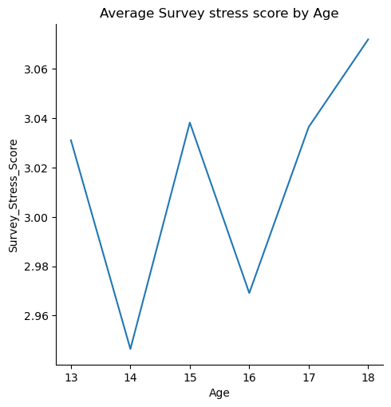

# Title: Mental Health and Screen Time in Youth

# Objective: Looking at the intersection of and possible relationship(s) between mental health and screen time among teenagers

# Data source: Kaggle
https://www.kaggle.com/datasets/aniruddhawankhede/mental-heath-analysis-among-teenagers (Direct mental health/screen time w/ ages 13-18 (15.5 yr mean))
  ### Data Type(s): 
User ID is an integer (numeric). Age is an integer (numeric). Gender is categorical (string). Social media hours is a float (numeric). Excersize hours is a float (numeric). Sleep hours is a float (numeric). Screen time hours is a float (numeric). Survey stress score is an integer (numeric, ordinal). Wearable stress score (stress measured by wearable devices) is a float (numeric). Support system is categorical (string).
  ### Restrictions: 
Age range of 13-18 is limited. Changes are not tracked over time. Wearable stress scroe range uses a different scale than survey. No geographic or demographic context is provided.
  
  ### Pros: 
Histogram shows minimal variation between age groups, which is ideal because there is no age bias in the data. No missing values. Float values easy to clean. Can handle mixed data types (floats and integers) in the same dataset. Large sample size (5000 participants). Age range 13-18 is highly relevant for screen time research. Clean, well-structured dataset with clear variable definitions. 
 
  ### Cons: 
 Will need to clean the dataset of every column except for age, screen time hours, and survey stress score. Limited age range may not generalize to broader population. Confounding variables such as exercise and sleep are not being analyzed by could influence results. 
 
# Data pulling (where/how did you get it?): 
We got our data from Kaggle. We downloaded it from the Kaggle website, the data was named as Mental_Heath_Analysis_Among_Teenagers by Aniruddha Wankhede. The dataset contains survey response about screen time, sleep patterns and their possible connection to menatl health among teenagers.

# Data cleaning (what choices did you make/what was selected/deleted and why?):
 There wasn’t a lot of data cleaning needed because the original dataset had already been mostly cleaned. However, we did make a few adjustments. First,  We chose to remove every column except for age, screen time hours, survey stress score and User Id by selecting only these three for a new dataframe but we removed the User_ID column after confirming that it contained no duplicate values. Since it was only used as a unique identifier and not needed for analysis, it was dropped to simplify the dataset. We did this because these three columns are the only ones necessary for our data analysis, and the other columns only crowd the data. Screen time hours is a float by default, so we wanted to round these numbers to the nearest integer to match the other variables. We did this by using the .astype('int') function on our new dataframe.
# Visualization reflections:

Average Screen Time by Age Line Graph: In this line graph, the age with the least average screen hours is 13, while the age with the highest is 16. Overall, there is a general increase in screen time hours from the age of 13 to 16, and then it drops to age 18.

Average Survey Stress Score by Age: In this line graph, we cannot identify a clear pattern of how age affects survey stress scores. The age that had the lowest average stress scores was 14, and the highest was 18. Because we did not plot this against screen time, it is impossible to tell from this graph if stress levels are related to screen time. However, if there were related, the Average Screen Time by Age and Average Survey Stress Score by Age graphs would share similar patterns/shapes, and they do not. 

Screen Time by Stress Score Boxplot: In this boxplot, each survey stress score value shares the same minimum, maximum, lower, and upper quartile screen time hour values. All boxes except for one (stress=4) show a median screen time hours as ~7.1. This means that screen time hours do not vary much at all by stress scores. In other words, people of various stress values shared roughly the same screen time hourage.

Correlation Matrix: To confirm the existence (or lack thereof) of a relationship between age, stress, and screen time, we created a correlation matrix; age and screen time have a correlation coefficient of 0.007 (no relationship), age and stress have a correlation coefficient of 0.013 (slightly higher correlation than the previous, but still no relationship), and stress and screen time have a correlation coefficient of -0.003 (no relationship). From the correlation matrix, we can clearly see that none of the variables in our dataframe share any correlation. 

# Insights (Where is this helpful? What conclusions should be drawn?):
We can conclude that based on this particular dataset of 13-18 year olds, there is no correlation between screen time hours and reported stress scores. This contradicts widespread belief that more screen time=more stressed teens. It also questions policies that focus solely on reducing screen time to improve mental health. We also found that neither screen time nor stress follow predictable age patterns, suggesting that individual and other environmental differences may impact stress by age more than screen time. This information is helpful for parents, indicating that they should focus more on how teens are using their screen time instead of how much. Additionally, when teens show stress/anxiety, clinical assessments and parents should investigate beyond screen habits and reducing screen time. Overall, current focus on screen time limits may not address teen stress, and other factors are likely more important.
